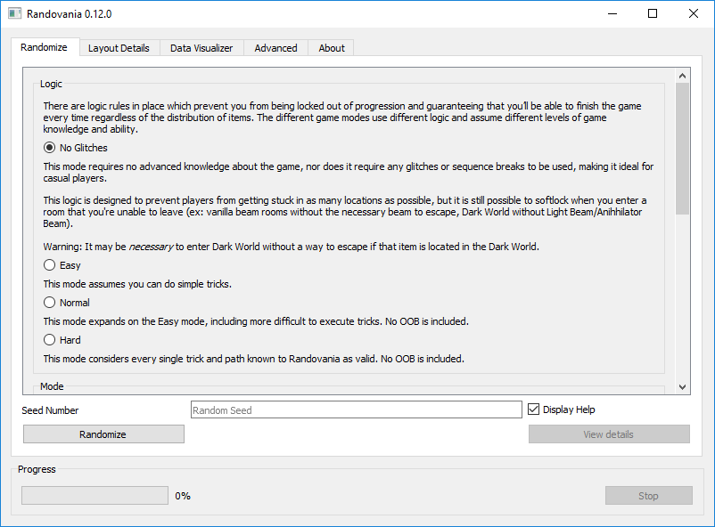
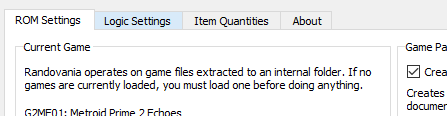
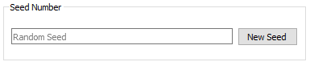
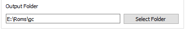
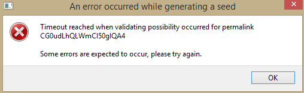
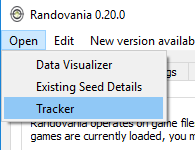
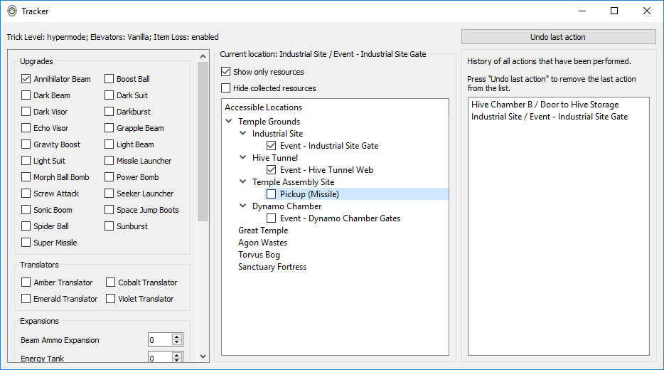

# Randovania

With Randovania, each Metroid Prime 2: Echoes playthrough shuffles the location of all items in the game.
You could find the Light Beam right off the start, or the Bombs deep inside Sanctuary Fortress.

## Installation

### Windows

In the [releases page](https://github.com/henriquegemignani/randovania/releases) we have zip files
with everything ready to use. Just extract and run!

## Usage

1.  Press 'Load Game' and then select a Metroid Prime 2: Echoes ISO file.
    Use a Nintendo GameCube version, either USA or PAL.
     

    -   Give it a few minutes to finish. This operation needs roughly 2 GiB of free
        storage in your system. (more precisely, local AppData)

2.  Configure the settings you wish to use in the 'Logic Settings' tab.
    

3.  Input a seed number. You can press 'New Seed' for one to be generated for you.
    

       a. Alternatively, you can import a Permalink someone shared with you!
        

4.  When finished, press 'Randomize' to create an ISO ready to be played. The ISO will be created
    in the folder you selected in 'Output Folder'
     
    -   The entire operation may take over 5 minutes to finish, depending on your computer.
    -   An operation may also fail with an error similar to this. In this case, choose another Seed
        Number and try again.
         

## Tracker

Randovania includes a simple "map" tracker for Echoes, accessible via the `Open` menu.

This tracker uses the logic and item loss configuration from the current permalink.

With it, you must act on each thing that trigger an event or has a pickup, as where you can go depends on where you are
in the game, as well as which items you've picked and event yo've triggered.

Currently, elevator randomizer is not supported for the tracker.

## FAQ

**I can't use this spider track, even though I have Spider Ball!**

The following rooms have surprising vanilla behaviour about their spider tracks:

-   Main Reactor (Agon Wastes)

      The spider tracks only works after you beat Dark Samus 1 _and reloads the room_.
      When playing with no tricks, this means you need Dark Beam to escape the room.

-   Dynamo Works (Sanctuary Fortress)

      The spider tracks only works after you beat Spider Guardian. When playing with no tricks,
      you can't leave this way until you do that.

**I can't open this Translator Gate, even though I have the correct translator!**

-   GFMC Compound (Temple Grounds)

      This is actually a Violet gate.

-   Meeting Grounds (Temple Grounds)

      This is actually a Violet gate.

-   Torvus Temple (Torvus Bog)

      In order to open the elevator, you also need to pick the item in Torvus Energy Controller.

**Where is the Flying Ing Cache inside Dark Oasis?**

The Flying Ing Cache in this room appears only after you beat the Power Bomb Guardian.

**When causes the Dark Missile Trooper to spawn?**

Defeating the Bomb Guardian. Be careful: defeating the Bomb Guardian also locks the blue door
in that room until you to visit Agon Energy Controller, which needs bombs.

**What causes the Missile Expansion on top of the GFMC Compound to spawn?**

Defeating the Jump Guardian.

## Community

Join the Metroid Prime Randomizer Discord: <https://discord.gg/gymstUz>

## Credits

Many thanks to [Claris](https://www.twitch.tv/claris) for
making the Echoes Randomizer and both collecting and providing this
incredible set of data which powers Randovania.

Claris also made the included [Menu Mod](https://www.dropbox.com/s/yhqqafaxfo3l4vn/Echoes%20Menu.7z),
a tool for practicing Echoes. For more information, see the
[Menu Mod README](https://www.dropbox.com/s/yhqqafaxfo3l4vn/Echoes%20Menu.7z?file_subpath=%2FEchoes+Menu%2Freadme.txt).

Also thanks to [Dyceron](https://www.twitch.tv/dyceron) for motivation and testing.

## Developer Help

1.  Download and install Python 3.7 64-bit: <https://www.python.org/downloads/release/python-372/>
2.  Ensure you have an updated pip: `python -m pip install --upgrade pip`
3.  Install requirements: `python -m pip install -r requirements.txt --no-use-pep517`
4.  Install Randovania as editable: `python -m pip install -e .`
5.  Do your changes
6.  Run with `python -m randovania`

Suggested IDE: [PyCharm Community](https://www.jetbrains.com/pycharm/download/)
