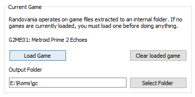

# Randovania
With Randovania, each Metroid Prime 2: Echoes playthrough shuffles the location of all items in the game.
You could find the Light Beam right off the start, or the Bombs deep inside Sanctuary Fortress.  

## Installation

### Windows

In the [releases page](https://github.com/henriquegemignani/randovania/releases) we have zip files
with everything ready to use. Just extract and run!

## Usage

1. Press 'Load Game' and then select a Metroid Prime 2: Echoes ISO file.
Use a Nintendo GameCube version, either USA or PAL.

   - Give it a few minutes to finish. This operation needs roughly 2 GiB of free
   storage in your system. (more precisely, local AppData)

2. Configure the settings you wish to use in the 'Logic Settings' tab.

  
3. Input a seed number. You can press 'New Seed' for one to be generated for you.

    a. Alternatively, you can import a Permalink someone shared with you!
     

4. When finished, press 'Randomize' to create an ISO ready to be played. The ISO will be created
in the folder you selected in 'Output Folder'

   - The entire operation may take over 5 minutes to finish, depending on your computer.
   - An operation may also fail with an error similar to this. In this case, choose another Seed
   Number and try again.
   
   
   
## Community

Join the Metroid Prime Randomizer Discord: https://discord.gg/gymstUz
 
## Credits

Many thanks to [Claris](https://www.twitch.tv/claris) for
making the Echoes Randomizer and both collecting and providing this
incredible set of data which powers Randovania.

Claris also made the included [Menu Mod](https://www.dropbox.com/s/yhqqafaxfo3l4vn/Echoes%20Menu.7z),
a tool for practicing Echoes. For more information, see the
[Menu Mod README](https://www.dropbox.com/s/yhqqafaxfo3l4vn/Echoes%20Menu.7z?file_subpath=%2FEchoes+Menu%2Freadme.txt).

Also thanks to [Dyceron](https://www.twitch.tv/dyceron) for motivation and testing.
