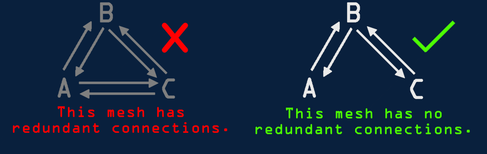

# Instructions and Standards for the Development of Organized Logic Databases  
  
  
## REGIONS, AREAS, AND NODES  
There exist 3 tiers of "Location" in the Randovania logic database - Regions, Areas, and Nodes.  
  
Regions represent large swathes of the game's world, and a standard game will only have a few of these, often less than ten. Regions contain many areas grouped together. The criteria for what is and isn't its own region are mostly arbitrary. Generally, areas within the same region should be geographically adjacent, rather than being disjoint, and regions should have common themes. In addition, regions are usually drawn up as they are demarcated in the game being mapped. Regions usually have only a few connections to other regions, such as elevators, portals, or teleporters, though standard docks can still connect rooms between two different regions.  
  
Areas represent a single bite-sized chunk of the game, usually only a single room. The term "room" is often used interchangeably with area. Areas should remain true to the game - avoid excluding areas, even if you deem them irrelevant to randomization. Often, areas aren't given explicit or canonical names, and in this case it will be up to the database author to choose an appropriate name for a given area.  
  
Nodes represent a single point in a given area. Nodes are primarily used to represent pickups a player can collect, events a player can trigger, and docks to other areas. In addition, there exist some special nodes types, which are often game specific. The generic node, which has no specific game object associated with it, can be used for organizational purposes.  
  
  
## THE RESOURCE DATABASE  
In addition to mapping the geography of the game, it is necessary to define the different parameters a player is expected to progress within. The resource database defines tools a player has to progress, and the requirements they may be asked to overcome.  
  
Resources include items the player can obtain, tricks they can perform, events that can be triggered, and other such information.  
  
  
## PICKUPS, DOCKS, AND EVENTS  
Pickups represent a permanent inventory item which the player can acquire.  
  
Events represent a one-time, irreversible action the player can take which changes the game's logic. Events can only be performed once a game, and cannot be undone.  
  
Docks represent connections between two rooms. Docks should represent standard doors or connections, linking two geographically adjacent game areas. While it is possible for a dock to connect two rooms from different regions, special devices such as portals, elevators, fast-travel beacons, and other long-distance or inter-regional travel mechanisms should be represented as Teleporters.  
  
  
## DEFINING LOGIC  
Logic is written by setting requirements to traverse from one node to another. The selected node in the Nodes menu represents the starting node, and the destination in the Connections dropdown shows which node you are traveling to. Nodes are one-way: being able to travel from A to B does not necessarily imply that the player can also travel from B to A. Logical requirements can require the item to posess an item, perform a trick, complete an event, or play on a certain version of the game in order to pass. In addition, Block Requirements can be used to group multiple individual requirements together.  
  
  
  
  
  
## AND, OR, TRIVIAL, AND IMPOSSIBLE  
If multiple conditions are required to traverse between two nodes, they can be grouped together either under a Block Node. There exist two types of block nodes: the "And" block and an "Or" block. For an And block to be satisfied, all underlying conditions must be true, and no underlying condition can be false. For an Or block to be satisfied, at least one underlying condition must be true.  
  
An And block with no underlying conditions is Trivial. Because there are no underlying conditions, the And block automatically has all of its conditions satisfied at all times (because there are no checks that can be failed). If a logical requirement is Trivial, that means that the player can always complete it, no matter what condition they are in.  
  
An Or block with no underlying conditions is Impossible. Because an Or block requires at least one of its conditions to be true in order to be possible, an Or block with no conditions can never be completed, and is thus Impossible. If a logical requirement is Impossible, that means the player never satisfies the condition, no matter what state they are in.  
  
  
## NODE VISITS AND REVISITS  
Pickup nodes can be revisited even after the pickup has been acquired. Even when there is no longer an item present, the generator still treats it as a valid connection to and from other nodes. In addition, events and pickup nodes are automatically collected and activated when the generator crosses them.  
  
Resource expenditures, such as Health, are incurred every time the generator crosses a given edge. If, in reality, the resource only needs to be expended once, it is best to use an event to track whether this has been done already.  
  
  
## DOCK REQUIREMENTS AND TEMPLATES  
In addition to the requirements explicitly provided for reaching one node from the other, docks can also have implicit requirements defined to limit when the player can use them. These implicit requirements will not prevent a player from reaching the dock from another node in the same room, but they will not be allowed to use the dock to leave the room unless they satisfy the dock requirements.  
  
Similarly, logic templates can be defined to keep track of whether the player can perform some given action without listing all of the individual requirements for it each time. For example, in Metroid Prime, you need the Power Beam, Charge Beam, Super Missile item, at least 5 Missiles, and a visor other than Scan Visor in order to actually shoot a Super Missile. Instead of putting in each of those requirements individually for each instance where the player is expected to shoot a Super Missile, it makes sense to define a single template which holds all these requirements and can be reused whenever called for. This can make your logic database much tidier.  
  
  
## NODE FLAGS  
There exist various contextual flags that can be applied to nodes.  
  
Pickups should be tagged with Major if the item present in this location is a major item in the vanilla game. The definition of a major item is somewhat arbitrary, but major items are usually unique, uncommon, and provide a direct means of progressing to the player. Marking major items in this fashion is necessary for generating major/minor seeds.  
  
Any node can be marked as Healing if the player would be able to recover their full health at this node.  
  
If a specific node represents a location in which the player would spawn in this area, it should be marked as Area Spawn. This status is mutually exclusive with all other nodes in the same room. The player can only have one spawn point per area. If the player cannot spawn in this area, the placement of this mark is unimportant.  
  
  
## NODE MANAGEMENT AND REDUNDANT EDGES  
It is important to note that a database does not need to have every connection betwen two nodes defined in order to work. If, for example, we have three nodes A, B, and C, where the player can travel from any one node to any other, it is not necessary to explicitly permit the player to travel from A to C. If they can travel from A to B and then from B to C, the generator understands they can also travel from A to C. In fact, you should define the minimum feasible number of node connections when writing logic. This makes logic easier to read and edit, as well as being more optimal for generation.  
  
Sometimes, rooms exist in which every node connects to every other node in some unique and complicated way, such that no simplifications exist. In this case, often the logic involved can be made easier to work with by adding a node to an arbitrary location in the room. By adding extra nodes, you can represent in-between points between the existing nodes in a room, which is often helpful to reduce the number of possible scenarios that must be considered and to make the room's logic more organized.  
  
  
  
  
  
## NAMING CONVENTIONS  
Area names should be memorable and descriptive. If your game does not provide an official name for a room, you will need to name it yourself. Avoid using in-jokes that newer players may be unfamiliar with, and remember that while a funny room name now and then can be good, it should not come at the expense of utility. Needless to say, profane or offensive names will be rejected outright. If a game's community has already adopted community names for rooms, it is best to use those as well, as many resources will have already been created using them, and players familiar to the game will easily adapt to your database. It can occasionally be worthwhile to alter or ignore an established community name, however, if it comes into conflict with the aforementioned principles.  
  
Node names do not need to be memorable, and should be purely descriptive. Because an area contains only a few nodes, anyone reviewing the database will almost certainly know what each node refers to. In addition, there are a few naming conventions that exist for specific node types:  
  
Pickup nodes should follow the format  
Pickup (Pickup Type)  
  
If two pickups in a room would share the same name, it is required that you add some descriptive text to their names to distinguish them. For example,  
Pickup (Lower Ledge Missile Expansion)  
Pickup (Morph Tunnel Missile Expansion)  
  
Event nodes should follow the format  
Event - Event Name  
  
And doors should adhere to  
Door to Room Name  
  
  
## COMMENTS  
Any block requirement can be supplemented with a comment. Comments can serve multiple purposes. Comments may be used as a way to justify design decisions to other Database creators, as a means to mark something for future review, or as a description of the block's logic, so that players and creators can understand how some sequence of actions can be performed.  
  
Comments should be at least somewhat professional in tone. It is not necessary that comments form full sentences or use formal language, but they should communicate their message and purpose clearly. Avoid leaving comments that you wouldn't want another player to see.  
  
  
## TRICK VIDEO DOCUMENTATION  
Comments, like most text in Randovania, will automatically hyperlink any links that are included. Although many tricks are obvious in their implementation, for tricks that are either obscure, difficult to perform, or not obvious to the novice, it is advised that you document such a trick. The best way to document a trick is to provide video footage of it being performed. Trick performances should ideally meet as many of the following criteria as possible:  
  
Videos should have clear, high-quality audio and video. Background static and fuzzy video are undesirable.  
  
Videos should be appropriate in length. Demonstrations of an individual trick should be brief, only a few minutes long. Longer videos are more appropriate for the description of the trick in general as part of the Resource Database.  
  
Videos should include an input display, showing which buttons the player has pressed and what analog positions were used to achieve a given outcome. A verbal or textual description of the inputs will also suffice.  
  
Videos which include instructional voiceover are generally preferred to those which feature only the game audio. Captions describing the trick are also viewed preferably.  
  
Videos describing a group of related tricks in a specific area need not be linked repeatedly if they cover all iterations of the trick in a given block. If there are multiple videos being used, or if some sets of requirements have no video associated, the same video can be linked multiple times, with different timestamps embedded in the links directing the player to the segment of the video dedicated to each particular implementation.  
  
Videos should be uploaded to YouTube - Twitch clips and VODs can have heavy load times, and old clips can be deleted by Twitch. YouTube links should be canonical, and should have unneccessary information, like playlist data and channel suffixes, stripped from the URL.  
  
  
