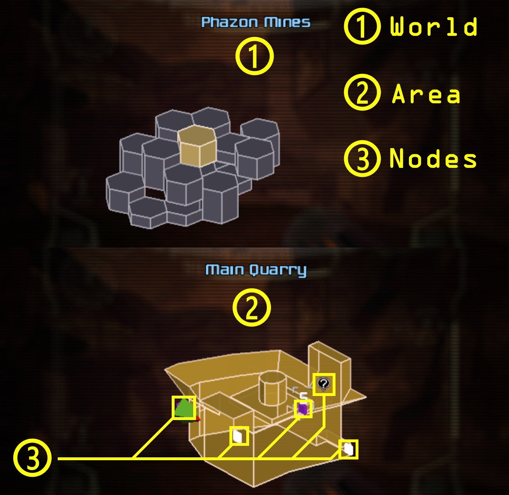
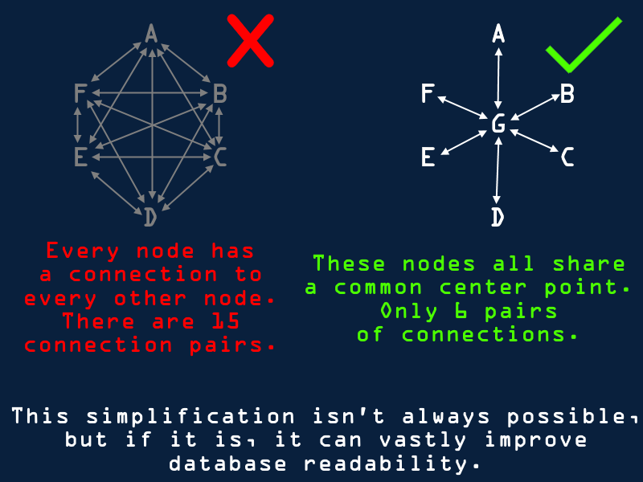

# Instructions and Standards for the Development of Organized Logic Databases  
  
  
## WORLDS, AREAS, AND NODES  
There exist 3 tiers of "Location" in the Randovania logic database - Worlds, Areas, and Nodes.  
  
  
  
Worlds represent large swathes of the game's playable space, and a standard game will only have a few of these, often less than ten. Worlds contain many areas grouped together. The criteria for what is and isn't its own world are mostly arbitrary. Generally, areas within the same world should be geographically adjacent, rather than being disjoint, and worlds should have common themes to their design - in other words, areas within a world should feel as though they belong to the same group. In addition, worlds are usually drawn up as they are demarcated in the game itself, if a similar distinction exists within the game. Worlds usually have only a few connections to other worlds, such as elevators, portals, or teleporters, though standard docks can still connect areas between two different worlds.  
  
Areas represent a single bite-sized chunk of the game, usually only a single room. The term "area" is often used interchangeably with room. Areas should remain true to the game - avoid excluding areas, even if you deem them irrelevant to randomization. Often, areas aren't given explicit or canonical names, and in this case it will be up to the database author to choose an appropriate name for a given area.  
  
Nodes represent a single section within a given area. The bulk of the logic rests in dictating when a player can or can't cross from one node to another. The links between these nodes are known as Connections, and may also be referred to as edges. Collectively, a set of nodes and connections may be referred to as a mesh. Nodes are primarily used to represent pickups a player can collect, events a player can trigger, and docks to other areas. In addition, there exist some special nodes types which are often game specific. Lastly, the generic node, which has no specific game object associated with it, can be used for organizational purposes, to make an area's layout simpler to work with.  
  
  
## THE RESOURCE DATABASE  
In addition to mapping the geography of the game, it is necessary to define the different game elements the player is capable of interacting with. The resource database defines tools a player has to progress, and the requirements they may be asked to overcome.  
  
Resources include items the player can obtain, tricks they can perform, events that can be triggered, and other such information.  
  
  
## PICKUPS, DOCKS, AND EVENTS  
Pickup Nodes represent a location in the game where something can be collected, with the intent that this pickup can be replaced with something else during seed generation.  
  
Events represent a one-time, irreversible action the player can take, and they can be performed if the generator is capable of reaching an associated event node. Event nodes cannot be crossed without activating the event in question. Events can only be performed once in a playthrough, and cannot be undone.  
  
Dock nodes represent connections between two areas. Docks should represent standard doors or connections, linking two geographically adjacent but distinct game areas. Docks come in several different flavors, defined by the database creator, each of which carrying their own logical requirements to be used. While it is possible for a dock to connect two areas from different worlds, special devices such as portals, elevators, fast-travel beacons, and other long-distance or cross-world travel mechanisms that don't resemble standard docks should be represented as Teleporters.  
  
  
## DEFINING REQUIREMENTS  
In order to define the logic of a game, it is necessary to determine what actions the player is and is not capable of performing. To do this, it is necessary to write requirements. Requirements are written by setting which conditions the generator must satisfy in order to traverse from one node to another. The selected node in the Nodes menu represents the starting node of the connection, and the destination in the Connections dropdown shows which node you are traveling to. Nodes are one-way: being able to travel from A to B does not necessarily imply that the player can also travel from B to A. Requirements can be enforced depending upon whether the player posesses an item, is able to perform a trick, has completed an event, or if they're playing on a certain version of the game in order to pass. In addition, Block Requirements can be used to group multiple individual requirements together. Some requirement types can also be negated, such that a player can only pass a requirement if they do not hold an item, or have yet to trigger an event.  
  
  
  
  
  
## AND, OR, TRIVIAL, AND IMPOSSIBLE  
If multiple conditions are required to traverse between two nodes, they can be grouped together under a Block Node. There exist two types of block nodes: the "And" block and the "Or" block. For an And block to be satisfied, all underlying conditions must be true, and no underlying condition can be false. For an Or block to be satisfied, at least one underlying condition must be true.  
  
An And block with no underlying conditions is Trivial. Because there are no underlying conditions, the And block automatically has all of its conditions satisfied at all times (because there are no checks that can be failed). If a logical requirement is Trivial, that means that the player can always complete it, no matter what state they are in.  
  
An Or block with no underlying conditions is Impossible. Because an Or block requires at least one of its conditions to be true in order to be possible, an Or block with no conditions can never be completed, and is thus Impossible. If a logical requirement is Impossible, that means the player never satisfies the condition, no matter what state they are in.  
  
  
## NODE VISITS AND REVISITS  
Pickup nodes can be revisited even after the pickup has been acquired. Even when there is no longer a pickup present to be collected, the generator still treats it as a valid connection to and from other nodes. In addition, event and pickup nodes are automatically collected and activated when the generator crosses them, and cannot be saved for later unless the generator takes a different path altogether.  
  
Resource expenditures, such as Health, are incurred every time the generator crosses a given connection for which they are demanded. If, in reality, the resource only needs to be expended once, it is best to use an event to track whether this has been done already.  
  
  
## DOCK REQUIREMENTS AND TEMPLATES  
In addition to the requirements explicitly provided for reaching one node from the other, all dock types can also have implicit requirements defined to limit when the player can use them. These implicit requirements will not prevent a player from reaching the dock from another node in the same area, but they will not be allowed to use the dock to leave the area unless they satisfy the dock requirements.  
  
Similarly, requirement templates can be defined to keep track of whether the player can perform some given action without listing all of the individual requirements for it each time. For example, in Metroid Prime, you need the Power Beam, Charge Beam, Super Missile item, at least 5 Missiles, and a visor other than Scan Visor in order to actually shoot a Super Missile. Instead of putting in each of those requirements individually for each instance where the player is expected to shoot a Super Missile, it makes sense to define a single template which holds all these requirements and can be reused whenever called for. This can make your logic database much tidier.  
  
  
## NODE FLAGS  
There exist various contextual flags that can be applied to nodes.  
  
Pickup Nodes should be tagged with Major if the item present in this location is a major item in the vanilla game. The definition of a major item is somewhat arbitrary, and the exact distinction can often be a matter of debate within the community, but major items are usually unique, uncommon, and provide a direct means of progressing to the player. Marking major items in this fashion is necessary for generating major/minor seeds.  
  
Any node can be marked as Healing if the player would be able to recover their full health at this node. Avoid using this flag unless this process can be completed quickly and consistently, otherwise the player may be forced to tediously refill it.  
  
If a specific node represents a location in which the player would spawn in this area, it should be marked as Area Spawn. This status is exclusive - a single area can only have one spawn location. In games which support random teleporters, the spawn location also represents where the player will be spawned within the area after arriving.  
  
  
## NODE MANAGEMENT AND REDUNDANT EDGES  
It is important to note that a database does not need to have every connection betwen two nodes defined in order to work. If, for example, we have three nodes A, B, and C, where the player can travel from any one node to any other, it is not necessary to explicitly permit the player to travel from A to C. If they can travel from A to B and then from B to C, the generator understands they can also travel from A to C, so even if a direct transit from A to C is possible, it should still be marked Impossible for the sake of simplicity. In fact, you should define the minimum feasible number of node connections when writing logic. This makes logic easier to read and edit, as well as being more optimal for generation.  
  
  
  
Sometimes, areas exist in which every node connects to every other node in some unique and complicated way, such that no simplifications exist. In this case, often the logic involved can be made easier to work with by adding a node to an arbitrary location in the area. By adding extra nodes, you can represent in-between points between the existing nodes in an area, which is often helpful to reduce the number of possible scenarios that must be considered and to make the area's logic more organized.  
  
  
  
  
  
## TRICK DIFFICULTY  
The question of what difficulty a trick should be given comes up frequently, and this is because it is a complex question to consider. There are many aspects to consider when assigning a trick to one of the difficulty tiers. The tiers, and the role they serve in the database, are as follows  
  
### Disabled  
This "trick" isn't a trick at all. A trick with this difficulty level can't actually be toggled off by the player - as the name might suggest, this trick may still be required of the player even when the trick is "disabled", so you should never actually assign this difficulty to a trick.  
  
### Standard difficulties  
The standard difficulties, in order of relative difficulty, are Beginner, Intermediate, Advanced, and Expert. Beginner tricks represent the easiest possible iteration of any trick category. A beginner trick isn't necessarily approachable, easy, or even beginner friendly - rather, it's just that these tricks are the easiest and best for practice *in their category*. Each difficulty afterwards simply represents a step up in challenge, Expert representing the hardest tricks within a category that can be performed within reason. Trick difficulties are not absolute - a beginner trick in one trick category may be harder than an advanced trick in another.  
  
### Hypermode  
Hypermode tricks aren't fair. They are placed in their own difficulty so that players who wish to challenge their skill at the highest level can save themselves from the frustration these tricks inevitably bring. Hypermode tricks are stupid, inconsistent, random, or otherwise painful to perform. They may require a degree of precision which isn't possible for a human to provide with consistency, and may cause permanent and lasting problems for a player when attempted or even when completed successfully, such as causing them to lose items or corrupting their save data. Hypermode tricks may actually be easier than an expert or even advanced trick of their category to perform, but are so obscure, unpredictable, annoying, or punishing that players just don't like them.  
  
### Difficulty Considerations  
  
As has been discussed, there are many different criteria for deciding a trick's difficulty, and the task is ultimately very subjective. Remember that there's more worth considering than strictly the amount of "skill" the player must put in to perform the trick. Every time you add or modify a trick, you should ask yourself:  
  
- How familiar does a player need to be with a trick to perform it?  
- Is the trick consistent?  
- Are there consequences for attempting the trick?  
- How long does the trick take to attempt?  
- How long does it take before the player can try again?  
- Is the trick fun or flashy to perform, or does it feel like a drag on gameplay?  
- Could a player intuit this trick on their own?  
- How quickly could a player learn this trick?  
- How similar is this trick to other tricks of the same type?  
  
  
## NAMING CONVENTIONS  
Area names should be memorable and descriptive. If your game does not provide an official name for an area, you will need to name it yourself. Avoid using in-jokes that newer players may be unfamiliar with, and remember that while a funny area name now and then can be good, it should not come at the expense of utility. Needless to say, profane or offensive names will be rejected outright. If a game's community has already adopted community names for areas, it is best to use those as well, as many resources will have already been created using them, and players familiar with the game will easily adapt to your database. It can occasionally be worthwhile to alter or ignore an established community name, however, if it comes into conflict with the aforementioned principles.  
  
Node names do not need to be memorable, and should be purely descriptive. Because an area contains only a few nodes, anyone reviewing the database will almost certainly know what each node refers to. In addition, there are a few naming conventions that exist for specific node types:  
  
Pickup nodes should follow the format  
`Pickup (Pickup Type)`  
  
If two pickups in an area would share the same name, it is required that you add some descriptive text to their names to distinguish them. For example,  
`Pickup (Lower Ledge Missile Expansion)`  
`Pickup (Morph Tunnel Missile Expansion)`  
  
Event nodes should follow the format  
`Event - Event Name`  
  
And docks should adhere to  
`Dock Type to Area Name`  
  
In the case of two areas which have multiple docks of the same type to one-another, the database creator should modify the area name to indicate which is which. For example  
`Door to Solemn Temple Left`  
`Door to Solemn Temple Right`  
  
In addition, for docks which represent the outlet of a one-way area connection, and which cannot be used in reverse, docks should instead be named  
`Dock Type from Area Name`  
  
  
## COMMENTS  
Any block requirement can be supplemented with a comment. Comments can serve multiple purposes. Comments may be used as a way to justify design decisions to other Database creators, as a means to mark something for future review, or as a description of the block's logic, so that players and creators can understand how some sequence of actions can be performed.  
  
Comments should be at least somewhat professional in tone. It is not necessary that comments form full sentences or use formal language, but they should communicate their message and purpose clearly. Avoid leaving comments that you wouldn't want another player to see.  
  
  
## TRICK VIDEO DOCUMENTATION  
Comments added to an area's requirements will automatically hyperlink any links that are included. Although many tricks are obvious in their implementation, for tricks that are either obscure, difficult to perform, or not obvious to the novice, it is advised that you document such a trick. The best way to document a trick is to provide video footage of it being performed. Trick performances should ideally meet as many of the following criteria as possible:  
  
Videos should have clear, high-quality audio and video. Background static and fuzzy video are undesirable.  
  
Videos should be appropriate in length. Demonstrations of an individual trick should be brief, only a few minutes long, if even that. Longer videos are more appropriate for the description of the trick in general as part of the Resource Database.  
  
Videos should include an input display, showing which buttons the player has pressed and what analog positions were used to perform the trick. A description of the inputs will also suffice if the input is not being directly shown.  
  
Videos which include instructional voiceover are generally preferred to those which feature only the game audio. Captions describing the trick are also considered to be beneficial.  
  
Videos describing a group of related tricks in a specific area need not be linked repeatedly if they cover all iterations of the trick in a given block. If there are multiple videos being used, or if some sets of requirements have no video associated, the same video can be linked multiple times, with different timestamps embedded in the links directing the player to the segment of the video dedicated to each particular implementation.  
  
Videos should be uploaded to YouTube - Twitch clips and VODs can have heavy load times, and old recordings can be deleted by Twitch. YouTube links should be canonical, and should have unneccessary information, like playlist data and channel suffixes, stripped from the URL.  
